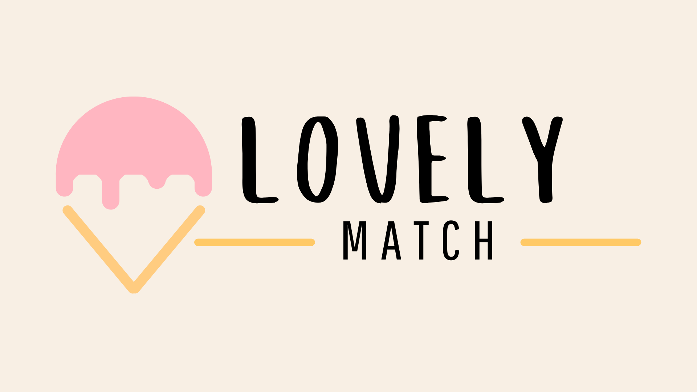

<div align="center">
  
  
  <h1>LovelyMatch – Sorveteria do Amor</h1>
  <p><strong>Projeto final | SENAI Valinhos | Técnico em Desenvolvimento de Sistemas</strong></p>
</div>

---

## Introdução
LovelyMatch é uma sorveteria temática que une amor, romance e experiências lúdicas em torno de sabores exclusivos. Cada sorvete representa um casal famoso, fictício ou simbólico, e o sabor é inspirado na personalidade e história do casal. O objetivo é proporcionar uma experiência divertida, interativa e memorável para os visitantes, explorando criatividade, gamificação e interação social.

---

## Guia Completo de Instalação e Uso


<details>
  <summary><b>COMO INSTALAR E EXECUTAR O PROJETO</b></summary>
<ol>
  <li><strong>Pré-requisitos:</strong><br>
    <ul>
      <li>Node.js instalado (<a href="https://nodejs.org/">download</a>)</li>
      <li>PostgreSQL instalado (<a href="https://www.postgresql.org/download/">download</a>)</li>
      <li>Git instalado (<a href="https://git-scm.com/downloads">download</a>)</li>
    </ul>
  </li>
  <li><strong>Clone o repositório:</strong><br>
    <pre><code class="language-sh">git clone https://github.com/annabeatriz17/Lovely-Gelato-Backend.git</code></pre>
  </li>
  <li><strong>Acesse a pasta do projeto:</strong><br>
    <pre><code class="language-sh">cd Lovely-Gelato-Backend</code></pre>
  </li>
  <li><strong>Instale as dependências:</strong><br>
    <pre><code class="language-sh">npm install</code></pre>
  </li>
  <li><strong>Configure o banco de dados:</strong><br>
    <ul>
      <li>Abra o PostgreSQL e crie um banco de dados (ex: <code>lovelyMatch</code>).</li>
      <li>Execute o script <code>src/database/schema.sql</code> para criar as tabelas.</li>
    </ul>
  </li>
  <li><strong>Configure o arquivo <code>.env</code>:</strong><br>
    <ul>
      <li>Copie o arquivo <code>.env.example</code> para <code>.env</code> (se existir).</li>
      <li>Preencha com seus dados locais (usuário, senha, nome do banco, porta etc).</li>
    </ul>
  </li>
  <li><strong>Testando conexão com o banco:</strong><br>
    <pre><code class="language-sh">npm run test:db</code></pre>
    <span>(opcional, se houver script de teste de conexão)</span>
  </li>
  <li><strong>Inicie o servidor:</strong><br>
    <pre><code class="language-sh">npm run dev</code></pre>
  </li>
  <li><strong>Acesse a aplicação:</strong><br>
    <ul>
      <li>O backend estará disponível na porta definida no <code>.env</code> (padrão: 3000).</li>
      <li>Use ferramentas como <a href="https://www.postman.com/">Postman</a> ou <a href="https://insomnia.rest/">Insomnia</a> para testar as rotas.</li>
    </ul>
  </li>
  <li><strong>Personalize e explore:</strong><br>
    <ul>
      <li>Adicione novos casais e sabores via rotas de criação.</li>
      <li>Explore as funcionalidades e personalize o projeto conforme sua criatividade!</li>
    </ul>
  </li>
</ol>
</details>

---
<details>
## Funcionalidades
- Listagem de sabores e casais
- Detalhes de cada casal e sabor
- Criação de novos casais e sabores
- Experiência lúdica e interativa
- Sem necessidade de login
- Visual moderno e responsivo
- Gamificação e micro-feedbacks
</details>

---

## Estrutura do Projeto
```
Lovely-Gelato-Backend/
├── src/
│   ├── config/
│   ├── controllers/
│   ├── database/
│   ├── models/
│   └── routes/
├── media/
│   └── Logo-lovelymatch.png
├── .env
├── package.json
└── README.md
```

---
<details>
## Tecnologias Utilizadas: 🚀
- Node.js
- Express
- PostgreSQL
- JavaScript
- HTML/CSS (front-end)
- Git & GitHub
</details>
---

## Sobre a Autora
- **Projeto desenvolvido para o curso Técnico de Desenvolvimento de Sistemas – SENAI Valinhos**
- Instrutores: Felipe Silva Santos, Felipe de Mattos Mamprim

---

<div align="center">
  <b>Pronto! O LovelyMatch estará rodando localmente.<br>Experimente, crie e compartilhe sabores únicos! 🍨</b>
</div>

---
