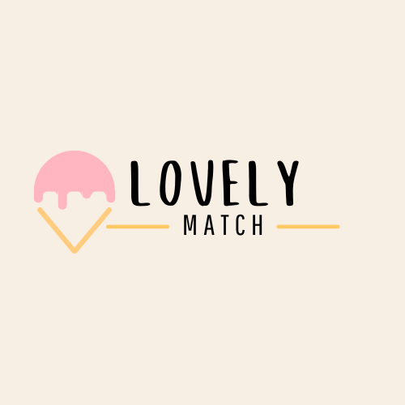

<div align="center">
  
  
  <h1>LovelyMatch – Sorveteria do Amor</h1>
  <p><strong>Projeto final | SENAI Valinhos | Técnico em Desenvolvimento de Sistemas</strong></p>
</div>

---

## Introdução
LovelyMatch é uma sorveteria temática que une amor, romance e experiências lúdicas em torno de sabores exclusivos. Cada sorvete representa um casal famoso, fictício ou simbólico, e o sabor é inspirado na personalidade e história do casal. O objetivo é proporcionar uma experiência divertida, interativa e memorável para os visitantes, explorando criatividade, gamificação e interação social.

---

## Instalação rápida

```sh
# Clone o repositório
git clone https://github.com/annabeatriz17/Lovely-Gelato-Backend.git

# Acesse a pasta
cd Lovely-Gelato-Backend

# Instale as dependências
npm install

# Configure o banco de dados
# (crie o banco e execute src/database/schema.sql)

# Configure o arquivo .env
# (preencha com seus dados locais)

# Inicie o servidor
npm run dev
```

O backend estará disponível na porta definida no `.env` (padrão: 3000).

---

## Funcionalidades
- Listagem de sabores e casais
- Detalhes de cada casal e sabor
- Criação de novos casais e sabores
- Experiência lúdica e interativa
- Sem necessidade de login
- Visual moderno e responsivo
- Gamificação e micro-feedbacks

---

## Estrutura do Projeto
```
Lovely-Gelato-Backend/
├── src/
│   ├── config/
│   ├── controllers/
│   ├── database/
│   ├── models/
│   └── routes/
├── media/
│   └── Logo-lovelymatch.png
├── .env
├── package.json
└── README.md
```

---

## Tecnologias Utilizadas
- Node.js
- Express
- PostgreSQL
- JavaScript
- HTML/CSS (front-end)
- Git & GitHub

---

## Sobre o Autor
- **Anna Beatriz Ribeiro Valentim**
- Projeto desenvolvido para o curso Técnico de Desenvolvimento de Sistemas – SENAI Valinhos
- Instrutores: Felipe Silva Santos, Felipe de Mattos Mamprim

---

## Sobre
Este projeto é apenas para fins educacionais e não possui licença comercial.

---

<div align="center">
  <b>Pronto! O LovelyMatch estará rodando localmente.<br>Experimente, crie e compartilhe sabores únicos! 🍨</b>
</div>

---
